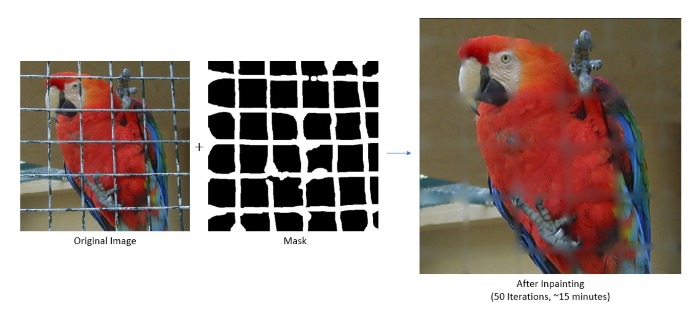

# Vector-Valued Image Regularization using PDEs

### <i>CS663 - Digital Image Processing, Autumn 2017 </i>

We implemented [this paper](http://ieeexplore.ieee.org/document/1401905/) by Tschumperle et al. on the PDE-based regularization of vector-valued images. A detailed report is attached below.

<iframe src='https://onedrive.live.com/embed?cid=EFDBCDD6F70761B0&resid=EFDBCDD6F70761B0%2115297&authkey=ABf-UG7KnVpOBDo&em=2&wdAr=1.7777777777777777' width='100%' height='450px' frameborder='0'>This is an embedded <a target='_blank' href='https://office.com'>Microsoft Office</a> presentation, powered by <a target='_blank' href='https://office.com/webapps'>Office Online</a>.</iframe>
